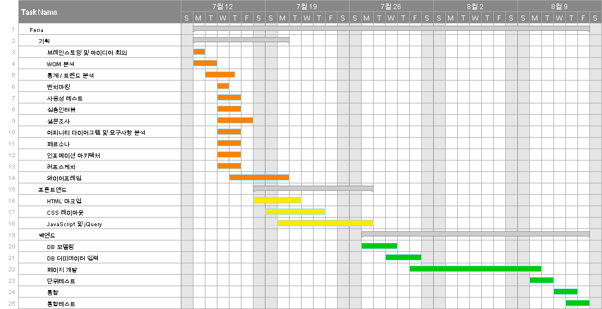
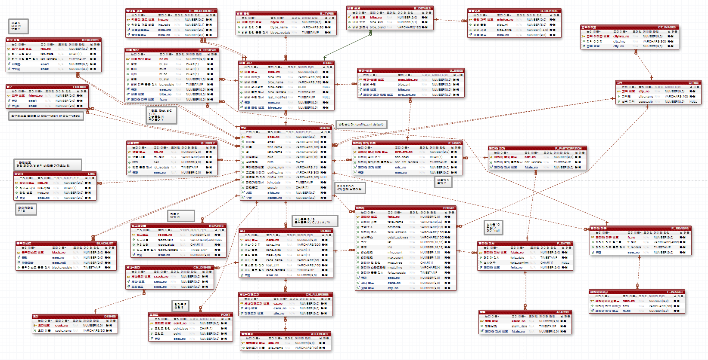
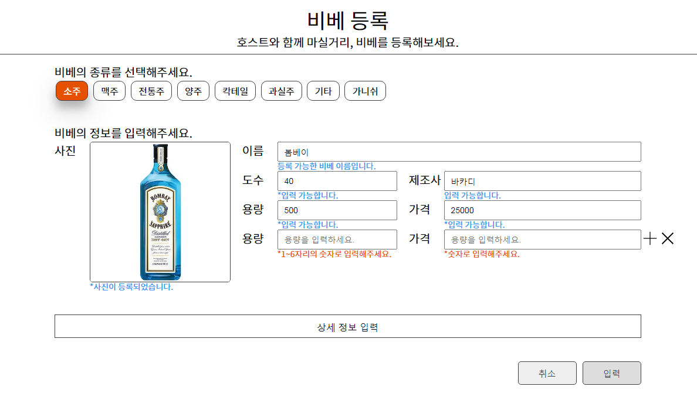
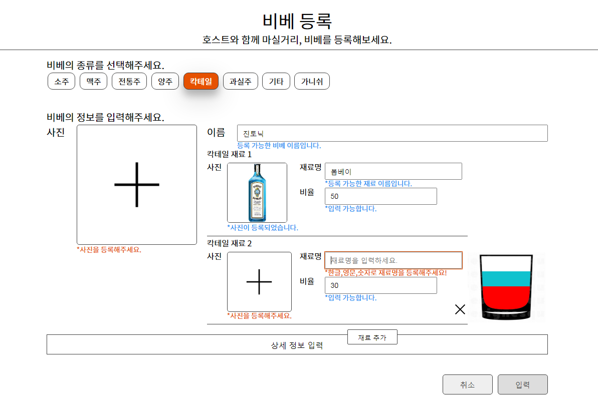
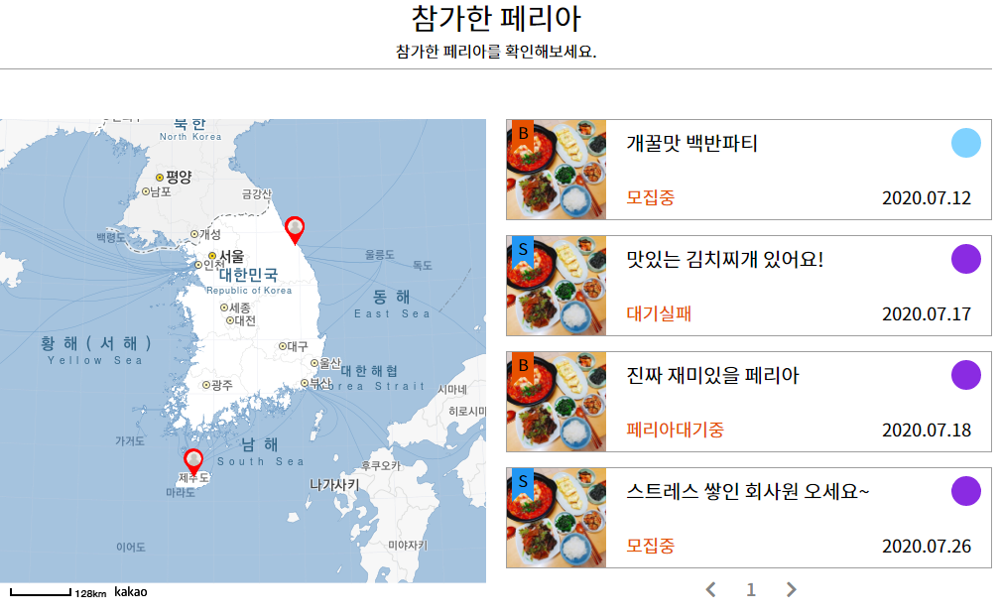

# Feria
## 프로젝트 개요
예기치 않은 여행 경험 예약 사이트.

프로젝트명 : 페리아(Feria) 

기간 : 2020.07.12~2020.08.08

## 프로젝트 주요 내용 

 **개발목표**
- 새로운 개념의 여행 서비스 고안- 파티 참가인원 매칭 기능 제공- 사용자가 즐길 수 있는 커뮤니티 기능- 일종의 위키피디아(술에 특화된 UCC 사전)

**개발환경**
- OS : window 7- Development Tool : Ecliplse, WebStorm, Apache-Tomcat, Sql Developer- Framework : Spring, mybatis- Language/Skills : HTML5, CSS, Java Script, JAVA, SQL, JSP &amp; Servlet,jQuery- DB : Quantum DB

**구현기능**
- 정규표현식을 이용한 유효성 검사- 로그인 API- 카카오 지도 API- 데이터 입력 및 출력- Ajax를 활용한 상태에 따른 옵션 변경- 친구 추가

**담당역할**
- 데이터 입력(손님이 준비하는 선물 입력)- 카카오 지도 API

**참여도 / 기여도**
- 참여도 : 100%, 기여도 : 30% 

## DB Modeling

 
 위 화면은 페리아의 DB 모델링 결과입니다. 총 29개의 테이블로 구성하였습니다. 기본적으로 Foriegn key를 사용하였고 'LIKE' 테이블과 같이 특정 테이블에는 논리적 Foriegn key를 사용하였습니다. 
 
## **프로젝트**  **:**  **페리아** **(Feria)** 화면 구성

  

 화면 및 구현기능 설명 : 위 화면은 페리아 서비스에서 게스트가 페리아(일종의 홈 파티)에서 호스트와 함께 마시기 위해 준비하는 비베(술)을 등록하는 기능을 담고 있습니다.  비베의 종류에 따라 3가지(칵테일/가니쉬/그 외)로 폼의 형태가 나뉩니다. 

위 화면은 칵테일, 가니쉬를 제외한 비베의 등록 양식입니다. 사용자가 입력하는 각 요소 별로 정규표현식을 이용하여 상세 정보를 제외한 항목들이 유효성 검사를 모두 통과하여야 입력 버튼이 활성화 되도록 하였습니다.

비베의 용량과 가격의 경우 여러 용량과 그에 따른 가격이 있을 것이므로 추가 입력이 가능하도록 하였고, 재차 유효성 검사가 진행되도록 하였습니다. 

  

 
 화면 및 구현기능 설명 : 위 화면은 칵테일 입력 폼입니다.칵테일의 경우 단일 비베(술)로 만들어지지 않고 여러 비베를 필요로 하므로 재료를 추가하고 그 비율을 입력하여 일종의 레시피를 등록하도록 하였습니다. 비율을 입력하면 옆의 유리잔에 해당 재료의 비율에 맞게 환산된 컬러 블록이 쌓이도록 하였습니다. 
 
  

 화면 및 구현기능 설명 : 위 화면은 참가한 페리아(파티) 출력 화면입니다. 참가했던 파티의 위치(위도,경도)를 기반으로 바운즈를 지정하여 현재 1페이지에 출력된 페리아의 위치를 지도에 표시하는 기능을 담고 있습니다. 
 
